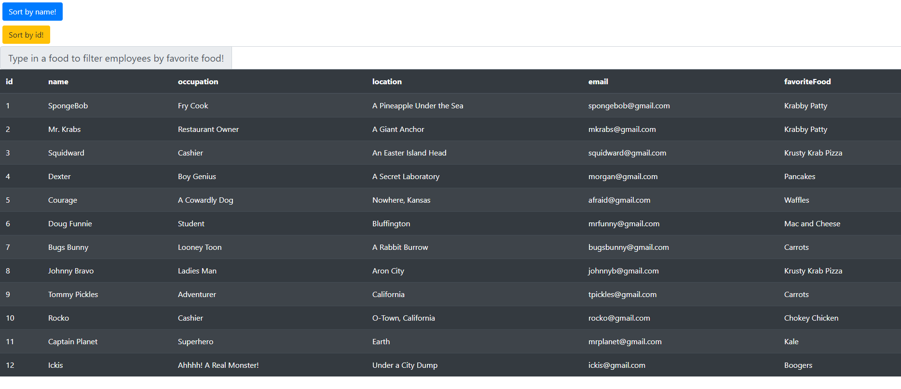
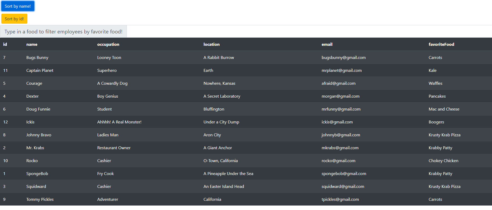
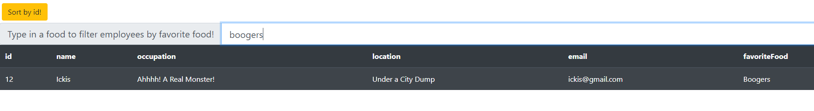

# employee-directory

</br>
<p align="center">
    
    
    
       
    
      
      
      
</p>

## Description

Employee Directory using React. Renders a table of employess which the user can sort by name or id, and filter by the employees' favorite food.

## Table of Contents

* [Installation](#installation)
* [Usage](#usage)
    * [Screenshots](#screenshots)
    * [Snippets](#snippets)
* [Credits](#credits)
* [License](#license)

## Installation

1. No installation necessary. Simply click on this link: 

<p align="center">
    <a href="https://phillipmerriman.github.io/employee-directory/" target="_blank"></a>
</p>

## Usage

### Screeshots

1. Main page



2. The user clicked the "Sort by name" button




3. The user filtered by favorite food



### Snippets


1. Filter the employees by there favorite food:

```javascript

  handleInputChange = (event) => {
     const { name, value } = event.target;
     this.setState({[name]:value});
     const newFavFoods = this.state.original.filter((employee) => {
       return employee.favoriteFood.toLowerCase().includes(value.toLowerCase());
     });
     this.setState({employees: newFavFoods});
  } 
    
```


## Credits

### Author

- 💼 Phillip Merriman: [portfolio](https://phillipmerriman.github.io/portfolio/)
- :octocat: Github: [phillipmerriman](https://github.com/phillipmerriman)
-  LinkedIn: [phillip-merriman-jr](https://www.linkedin.com/in/phillip-merriman-jr-62227485/)

### Built With

</br>
<p align="center">
    <a href="https://developer.mozilla.org/en-US/docs/Web/HTML"></a>
    <a href="https://developer.mozilla.org/en-US/docs/Web/CSS"></a>
    <a href="https://www.javascript.com/"></a>
    <a href="https://getbootstrap.com/"></a>
    <a href="https://nodejs.org/en/"></a>
    <a href="https://reactjs.org/"></a>
    <a href="https://www.npmjs.com/package/axios"></a>
</p>

## License
[](https://opensource.org/licenses/MIT)
